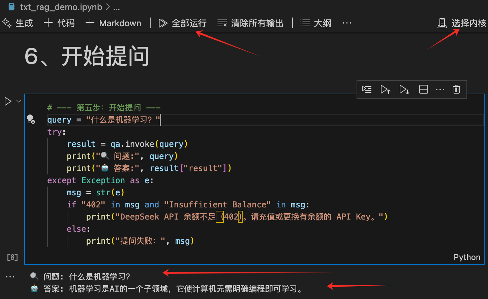
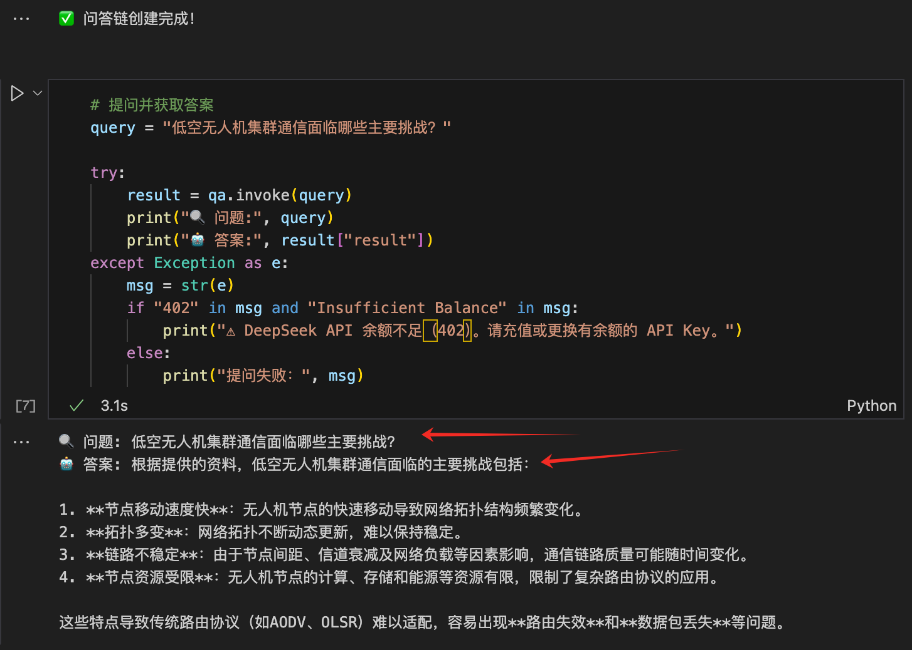
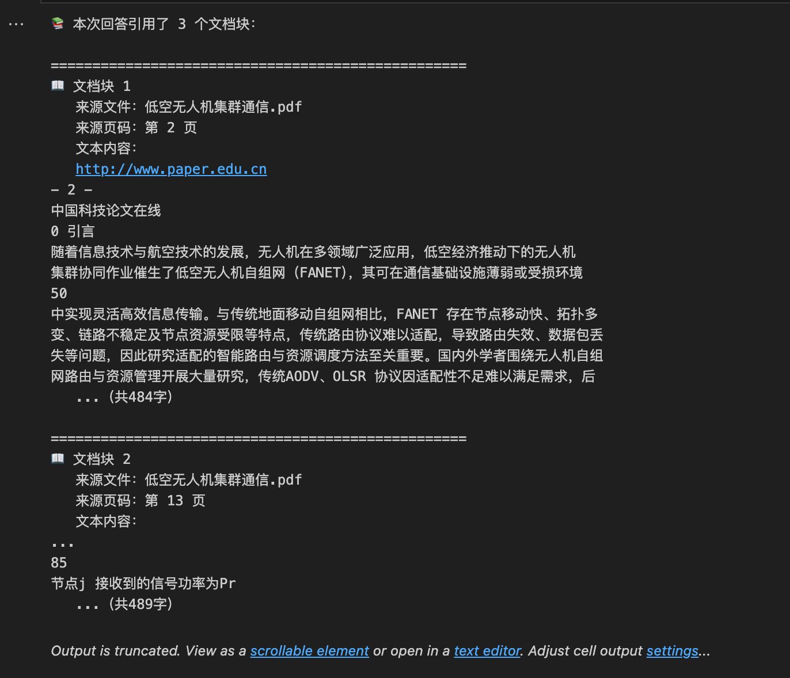

# 🧠 LangChain-RAG-DocQA：从零搭建 RAG 文档知识库

[](https://www.python.org/)
[](https://www.langchain.com/)
[](https://platform.deepseek.com/)
[](https://github.com/facebookresearch/faiss)
[](./LICENSE)

> 使用 **LangChain + DeepSeek + FAISS** 搭建的 RAG（检索增强生成）知识库问答系统。支持 TXT / PDF 文档，适合 AI 初学者从零理解 RAG 架构思想并动手实践。
>
> **关键词**：RAG、检索增强生成、LangChain、DeepSeek、FAISS、向量检索、知识库问答、中文 NLP、PDF 问答、LLM 应用开发

---

## 🚀 项目概述

大语言模型（LLM）存在两个根本问题：

1. **知识过时**：模型训练数据有截止日期，无法回答最新问题
2. **幻觉问题**：当模型不知道答案时，会自信地"编造"回答

**RAG（Retrieval-Augmented Generation，检索增强生成）** 的解决思路很直接：先从你的文档中检索出相关内容，把这些内容作为参考资料塞给模型，让它基于真实资料来回答。

### 项目亮点

- 🆓 **零成本嵌入**：使用本地 HuggingFace 模型做向量化，无需付费 API
- 🔍 **检索与生成分离**：可独立调试检索效果，确认满意后再调用 LLM
- 📖 **答案可溯源**：每个回答都附带引用文档块的来源文件名和页码
- 💾 **向量库持久化**：FAISS 索引保存到本地磁盘，下次直接加载
- 🔒 **配置与代码分离**：敏感信息通过 `.env` 文件管理

---

## 📚 两个渐进式 Demo

### 📘 Demo 1：TXT 文本问答（`txt_rag_demo.ipynb`）

**目标**：理解 RAG 的最小完整流程

- 使用简短 AI 概念文本作为知识库
- 涵盖：加载 → 分块 → 向量化 → 存储 → 问答的完整链路
- 代码简洁，适合初学者跑通第一个 RAG 应用

### 📕 Demo 2：PDF 文档问答（`pdf_rag_demo.ipynb`）

**目标**：掌握真实文档场景下的 RAG 实践
以「低空无人机集群通信.pdf」为知识库，在 Demo 1 基础上新增：

| 步骤  | 新增能力       | 学习要点                                        |
| ----- | -------------- | ----------------------------------------------- |
| Step1 | 知识库管理     | 可配置的 PDF 路径，替换即可切换知识库           |
| Step2 | 页码元数据     | 提取文本同时记录每页页码，为答案溯源打基础      |
| Step3 | 高级分块       | `RecursiveCharacterTextSplitter` + 语义边界切分 |
| Step4 | 独立检索调试   | 先执行相似度搜索查看检索效果（不消耗 Token）    |
| Step5 | 带来源的问答链 | `return_source_documents=True` 返回引用的源文档 |
| Step6 | 答案溯源       | 展示每个引用文档块的来源文件、页码和内容        |

---

## 🏗️ 系统架构

本系统数据流分为两个阶段：

```
┌─────────────────── 离线索引阶段（只跑一次） ───────────────────┐
│                                                                 │
│  知识库文档         文本提取          文本分块          向量化    │
│  (TXT/PDF)  ──→  (含页码元数据) ──→ (chunk) ──→  嵌入模型 ──→  │
│                                                         ↓       │
│                                              FAISS 向量库(本地)  │
└─────────────────────────────────────────────────────────────────┘

┌─────────────────── 在线问答阶段（每次提问） ───────────────────┐
│                                                                 │
│  用户提问 ──→ 嵌入模型 ──→ FAISS 相似度检索 ──→ Top-K 文本块   │
│                                                      ↓          │
│                              DeepSeek LLM ←── 问题 + 参考文本   │
│                                   ↓                              │
│                            生成答案 + 来源页码                    │
└─────────────────────────────────────────────────────────────────┘
```

---

## 🧩 关键技术细节

### 文档加载策略

| 场景       | 加载器          | 特点                                      |
| ---------- | --------------- | ----------------------------------------- |
| TXT 纯文本 | `TextLoader`    | 直接读取文本内容                          |
| PDF 文档   | `PyMuPDFLoader` | 自动记录每页页码到 metadata，支持答案溯源 |

### 文本分块方法

| 分块器                           | 应用场景 | 特点                                                    |
| -------------------------------- | -------- | ------------------------------------------------------- |
| `CharacterTextSplitter`          | TXT Demo | 按固定字符数切分                                        |
| `RecursiveCharacterTextSplitter` | PDF Demo | 按 `\n\n` → `\n` → `。` → `，` 递归切分，保持语义完整性 |

> 💡 **参数调优提示**：TXT Demo 用 chunk_size=100，PDF Demo 用 chunk_size=500 + overlap=50。可根据文档类型和问答效果调整。

### 本地向量化优势

使用 `shibing624/text2vec-base-chinese` 本地模型：

- ✅ 开源免费，无需 API Key
- ✅ 本地运行，零成本
- ✅ 专为中文优化

### FAISS 向量检索

- **高效存储**：毫秒级 Top-K 相似度检索
- **持久化**：支持本地索引保存与加载
- **集成性**：与 LangChain 无缝集成

---

## 🛠️ 技术栈

| 组件            | 选型       | 说明                                                                |
| --------------- | ---------- | ------------------------------------------------------------------- |
| **LangChain**   | 应用框架   | 流程编排，把文档加载、分块、检索、问答串成一条链                    |
| **DeepSeek**    | 大语言模型 | 理解问题 + 参考文本，生成自然语言答案                               |
| **FAISS**       | 向量数据库 | 高效存储和检索向量，毫秒级返回 Top-K 相似结果                       |
| **HuggingFace** | 嵌入模型   | 本地运行的中文向量模型（`text2vec-base-chinese`），免费无需 API Key |
| **PyMuPDF**     | PDF 解析   | 提取 PDF 文本并自动记录每页页码                                     |

---

## 📋 项目目录

```
LangChain-RAG-DocQA/
├── .env                    # 环境配置（API Key 等，不要提交到 Git）
├── .gitignore              # Git 忽略规则
├── readme.md               # 本文档
├── txt_rag_demo.ipynb      # Demo 1：TXT 文本问答
├── pdf_rag_demo.ipynb      # Demo 2：PDF 文档问答
├── test_doc.txt            # Demo 1 的示例文本（自动生成）
├── 低空无人机集群通信.pdf    # Demo 2 的示例 PDF
├── faiss_index/            # Demo 1 的向量库（自动生成）
├── faiss_index_pdf/        # Demo 2 的向量库（自动生成）
└── venv/                   # Python 虚拟环境
```

---

## 🚀 快速开始

### 1. 环境准备

确保已安装 Python 3.9+：

```bash
python3 --version
pip3 --version
```

### 2. 创建虚拟环境

```bash
# 创建虚拟环境
python3 -m venv venv
# 激活虚拟环境
source venv/bin/activate

# 安装 Jupyter（可选）
pip install jupyter
```

### 3. 获取 DeepSeek API 密钥

1. 访问 [platform.deepseek.com](https://platform.deepseek.com) 注册登录
2. 在 "API Keys" 页面创建新密钥
3. 复制生成的 `sk-xxxxxx` 字符串

### 4. 配置环境变量

在项目根目录创建 `.env` 文件：

```
DEEPSEEK_API_KEY=sk-你的密钥
HF_ENDPOINT=https://hf-mirror.com
```

### 5. 安装依赖

```bash
pip install langchain langchain-community langchainhub faiss-cpu sentence-transformers pymupdf python-dotenv langchain-deepseek
```

### 6. 运行项目

#### 方式一：Jupyter Notebook

```bash
# 执行指定的 notebook
jupyter nbconvert --to notebook --execute txt_rag_demo.ipynb
# 或者
jupyter nbconvert --to notebook --execute pdf_rag_demo.ipynb
```

#### 方式二：在 VSCode/Jupyter 中

进入 .ipynb 文件，选择内核，点击"全部运行"

---

## 🖼️ 效果展示

### TXT 问答效果



### PDF 问答效果



### PDF 问答溯源功能



---

## ❓ 常见问题

### ❌ OSError: We couldn't connect to 'https://huggingface.co'

**原因**：国内网络对 huggingface.co 不稳定
**解决**：在 `.env` 文件中添加国内镜像地址：

```
HF_ENDPOINT=https://hf-mirror.com
```

### ❌ APIStatusError: Error code: 402

**原因**：DeepSeek API Key 余额不足
**解决**：去 [DeepSeek 控制台](https://platform.deepseek.com) 充值或更换有余额的 Key

---

## 🚀 进阶方向

学完两个 Demo 后，你可以尝试：

- **支持更多格式**：Word、Markdown、HTML 等文档的加载与解析
- **优化检索精度**：尝试不同的 chunk_size、overlap、Top-K 参数组合
- **语义缓存**：对相似问题命中缓存，避免重复调用 LLM
- **多文档知识库**：同时加载多个文档，构建综合知识库
- **Web 界面**：用 Streamlit 或 Gradio 给系统加一个交互式前端

---

## 🤝 贡献

欢迎提交 Issue 和 Pull Request！如果这个项目对你有帮助，请给一个 ⭐ Star，这是对我最大的鼓励。

## 📄 License

本项目基于 [MIT License](./LICENSE) 开源。
